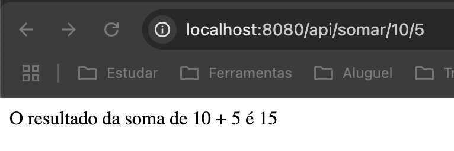

# 🚀 Atividade Spring Boot - Endpoint Soma

Projeto desenvolvido para a **Aula 1 de Desenvolvimento WEB II** utilizando Spring Boot.

## 🎯 Objetivo

Criar um endpoint REST GET chamado `/somar/{num1}/{num2}` que:
- Recebe dois números como parâmetros na URL
- Realiza a soma dos números
- Retorna o resultado em formato de texto

## 🛠️ Tecnologias Utilizadas

- **Java 24**
- **Spring Boot 3.5.3**
- **Spring Web**
- **Gradle**

## 📋 Funcionalidades

### Endpoint Implementado

```
GET /api/somar/{num1}/{num2}
```

**Exemplo de uso:**
```
http://localhost:8080/api/somar/10/5
```

**Resposta:**
```
O resultado da soma de 10 + 5 é 15
```

## 🚀 Como Executar

1. **Clone o repositório:**
   ```bash
   git clone https://github.com/Enzo-Radel/projetoSoma.git
   cd projetoSoma
   ```

2. **Execute a aplicação:**
   ```bash
   ./gradlew bootRun
   ```

3. **Acesse no navegador:**
   ```
   http://localhost:8080/api/somar/10/5
   ```

## 📸 Resultado da Execução



*Resultado obtido ao acessar o endpoint /api/somar/10/5 no navegador*

**URL testada:** `http://localhost:8080/api/somar/10/5`  
**Resposta:** `O resultado da soma de 10 + 5 é 15`

## 🧪 Testes

Você pode testar o endpoint das seguintes formas:

### No Navegador
- `http://localhost:8080/api/somar/10/5`
- `http://localhost:8080/api/somar/25/15`
- `http://localhost:8080/api/somar/100/200`

### Com cURL
```bash
curl http://localhost:8080/api/somar/10/5
```

### No Postman
- Method: `GET`
- URL: `http://localhost:8080/api/somar/{num1}/{num2}`

## 📁 Estrutura do Projeto

```
src/
├── main/
│   ├── java/
│   │   └── com/example/demo/
│   │       ├── AtividadeSpringBootApplication.java
│   │       └── HelloController.java
│   └── resources/
│       └── application.properties
└── test/
    └── java/
        └── com/example/demo/
            └── AtividadeSpringBootApplicationTests.java
```

## 🔧 Implementação

### HelloController.java
```java
@RestController
@RequestMapping("/api")
public class HelloController {

    @GetMapping("/somar/{num1}/{num2}")
    public String somar(@PathVariable String num1, @PathVariable String num2) {
        int numero1 = Integer.parseInt(num1);
        int numero2 = Integer.parseInt(num2);
        int resultado = numero1 + numero2;
        
        return "O resultado da soma de " + numero1 + " + " + numero2 + " é " + resultado;
    }
}
```

## ✅ Status

- [x] Endpoint `/api/somar/{num1}/{num2}` implementado
- [x] Recebe dois números via URL
- [x] Realiza soma corretamente
- [x] Retorna mensagem formatada
- [x] Testado no navegador
- [x] Aplicação funcionando

---

**Desenvolvido por:** Enzo Radel  
**Disciplina:** Desenvolvimento WEB II  
**Instituição:** [Nome da Faculdade] 